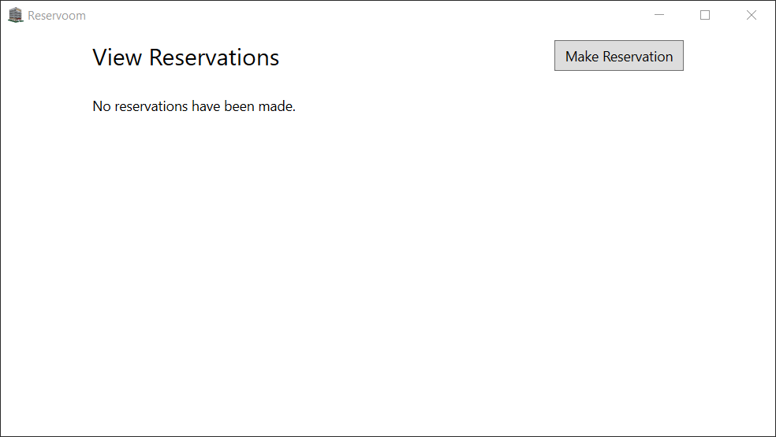
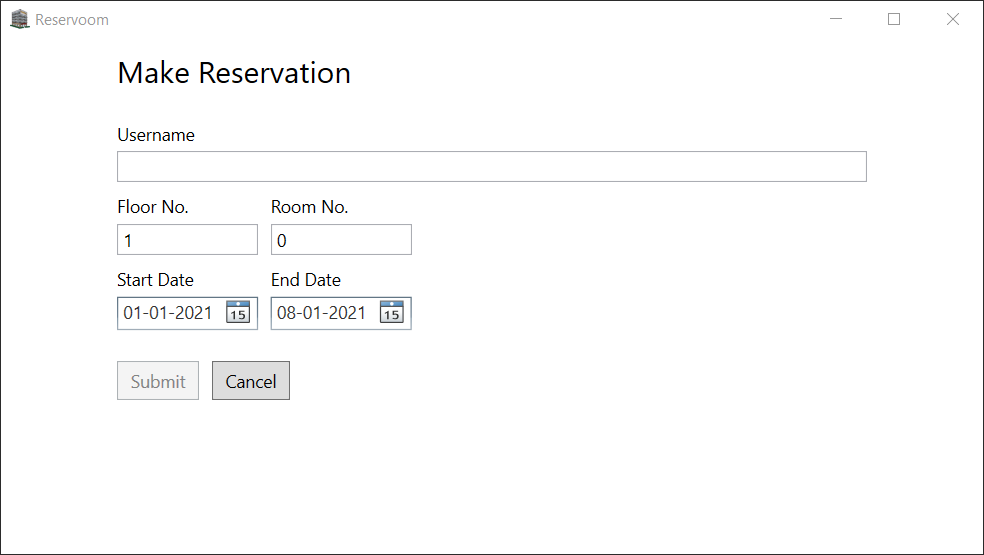
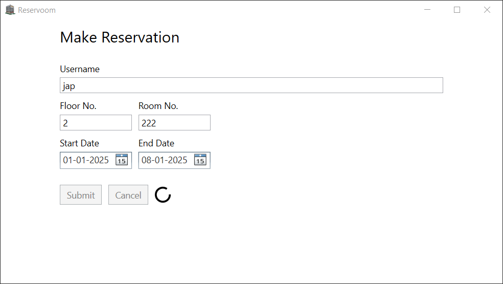
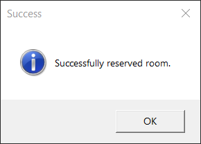
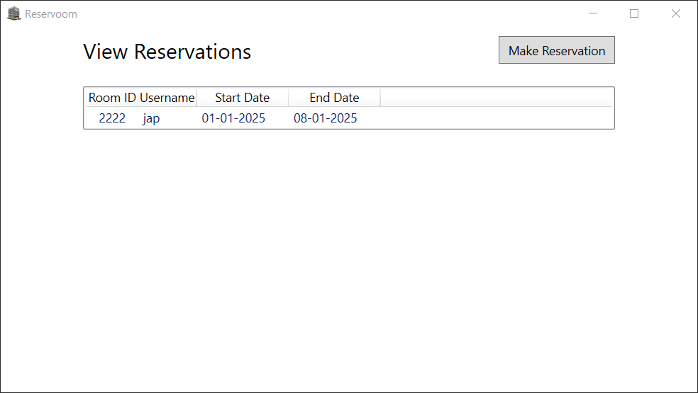

# Room Reservation System (MVVM, WPF, C#)

## 📌 Project Overview
Room Reservation System is a **WPF application** built with **C# and the MVVM architecture**. The system allows users to **add, save, and view room bookings** with a simple and interactive UI.

## 🛠️ Tech Stack
- **Frontend:** WPF, XAML
- **Backend:** C# (.NET 6/7)
- **Architecture:** MVVM (Model-View-ViewModel)
- **IDE:** Visual Studio

## 🚀 Features
- **Add Room Booking** – Enter room details, customer name, and dates.
- **Save Bookings** – Store data persistently in a database.
- **View Bookings** – Retrieve and display saved reservations.
- **MVVM Pattern** – Implements proper separation of concerns.
- **User-Friendly UI** – XAML-based modern interface.

## 📷 Screenshots
1. **Add Reservation**  
   

2. **Make Reservation**  
   

3. **Edit Reservation Details**  
   

4. **Display Message Status: Saved Successfully!**  
   

5. **View Reservations and Add New Reservations**  
   
